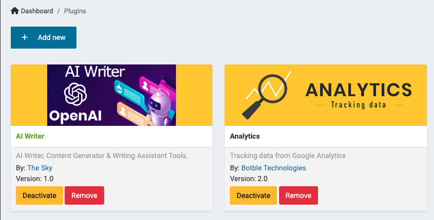
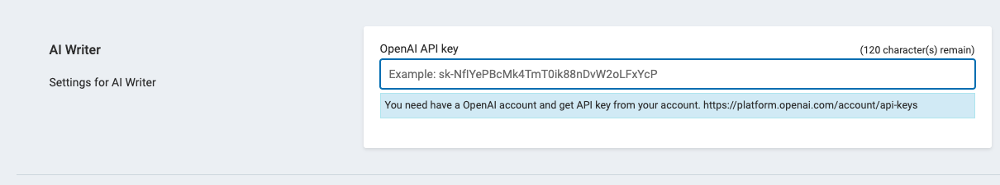
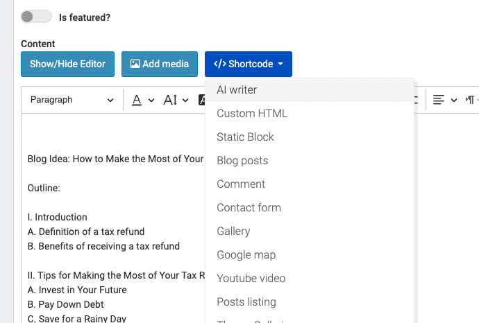

# AI - Writer

AiWriter is an AI-powered content writing tool. It uses advanced machine learning algorithms to analyze and understand text, allowing it to generate high-quality, unique content for your website or application. With AiWriter, you can easily create engaging, SEO-friendly content for blog posts, articles, and more, saving you time and effort while improving your online presence. Whether you’re a blogger, a marketer, or a developer, AiWriter is the perfect solution for all your content creation needs.

## Install plugin
Only available to users who purchase the AI-Writer plugin separately.

> Extract the plugin to the platform/plugins folder

> Active AI writer plugin in plugins area

## Setting OpenAI API key
> Go to __Admin -> Setting -> General__.

## Use

> AiWriter is developed as Shortcode

- Select 'AI writer' shortcode

- Select the topic you want to use and fill the primary keyword
- CLick on Get content button to load data into Editor 

