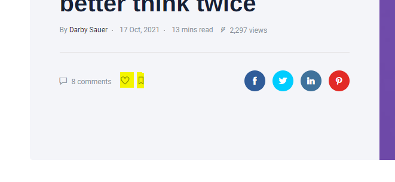

# Favorite/Bookmark post

Favorite function will allow users to save their favorite articles or read them again later

To can allow user add post to favorite or bookmark post then you can following:
+ Access to > __Admin -> Plugins
+ Active *Pro Posts* plugin

Note: *If the plugin is really active but favorite icon not show in the frontend, please Deactivate and activate again this plugin*

