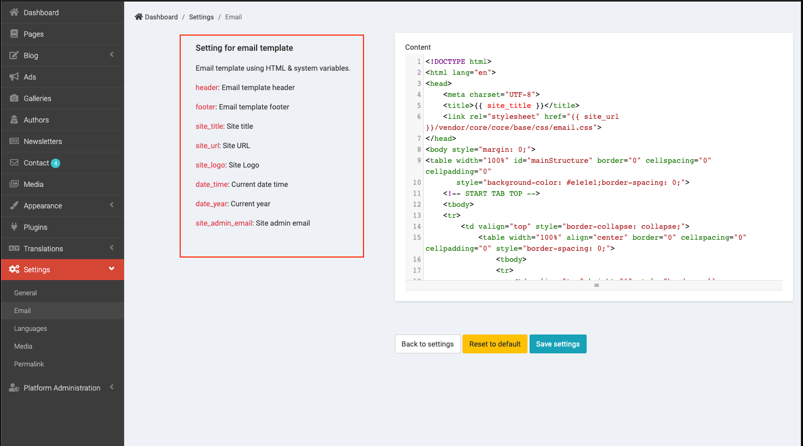

# Config

## Language

> Go to __Admin -> Setting -> General__.

Setting Language & Front site language direction

## Setting Email

> Go to __Admin -> Setting -> Email__.

It supports SMTP, Sendmail, Mailgun, SES, Postmark, Log and Array. We suggest use Mailgun to send mail.

## Edit Email template

> Email template using __HTML & system variables__.You need to know __HTML__ and __Laravel blade__.

## Setting media

> You can enable Chunk size upload if you want to upload big file size.

