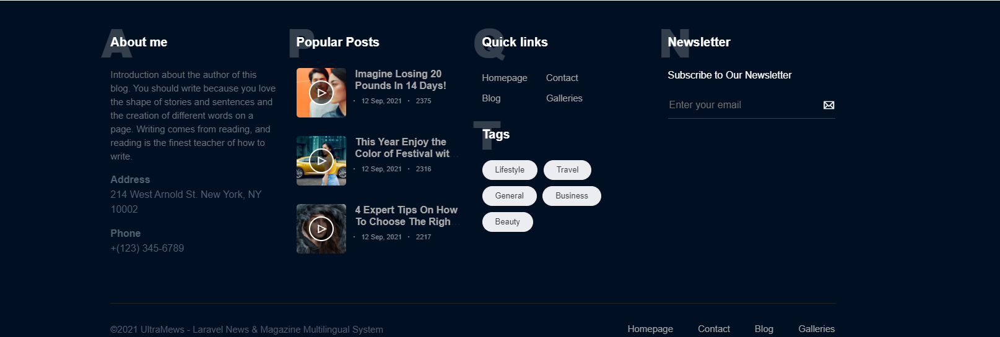
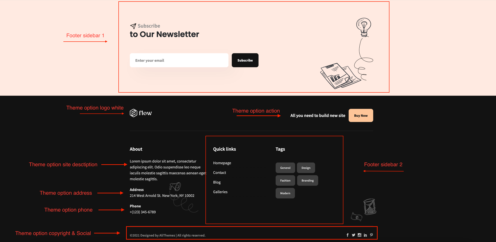
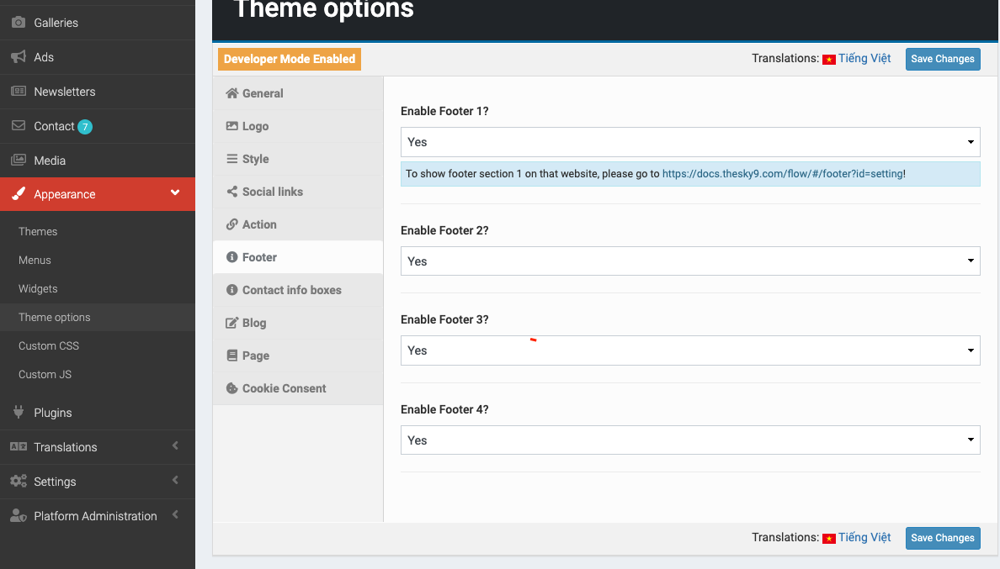
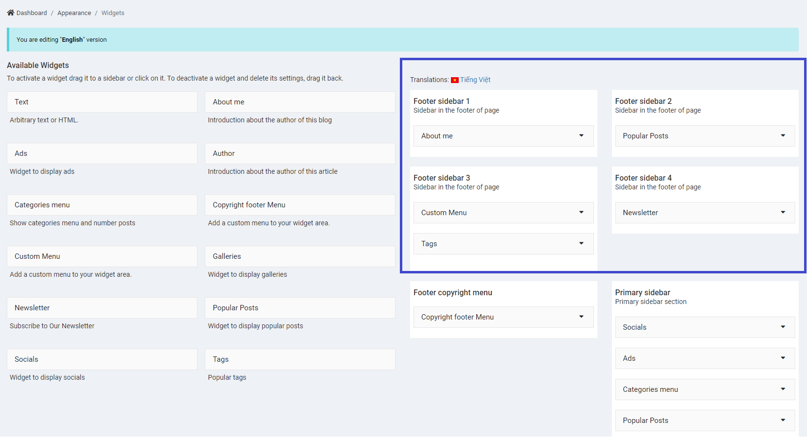
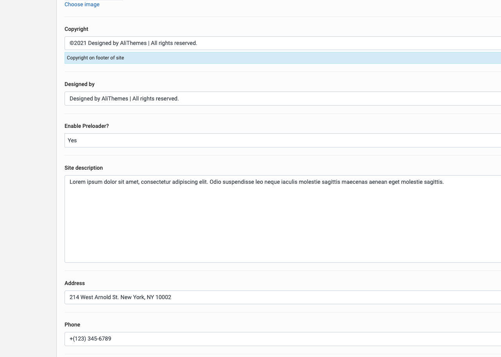
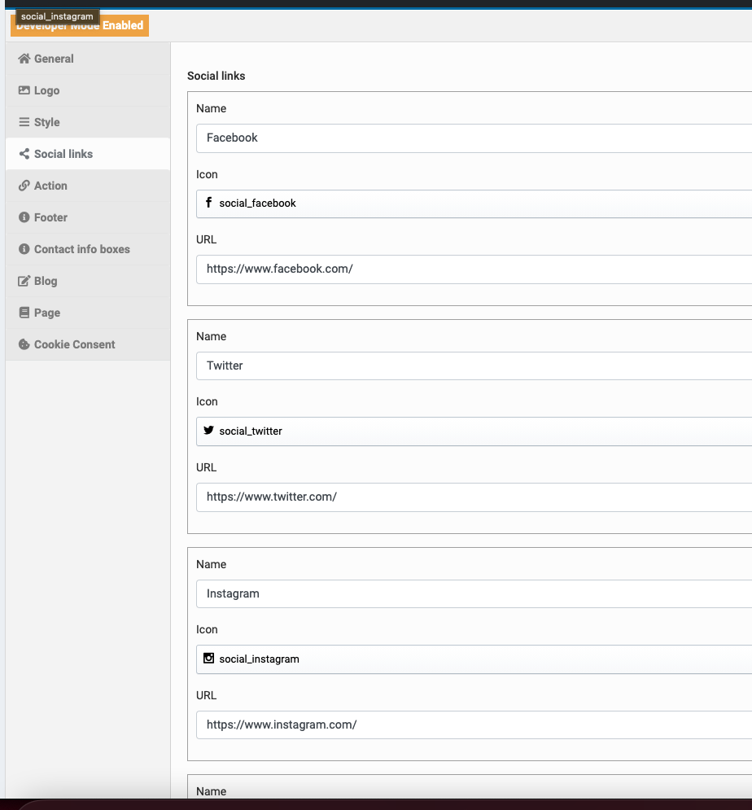

# Footer

## Overview

> Overview

> Detail

## Setting

> Go to __Admin -> Appearance -> Theme Option > Footer__.

- To show footer section 1,2,3,4

## Footer sidebar

> Go to __Admin -> Appearance -> Widgets__.

## Footer option

> Go to __Admin -> Appearance -> Theme Option > General__.

- Config Copyright, Designed by, Site description, Address, Phone.

- Config Social

