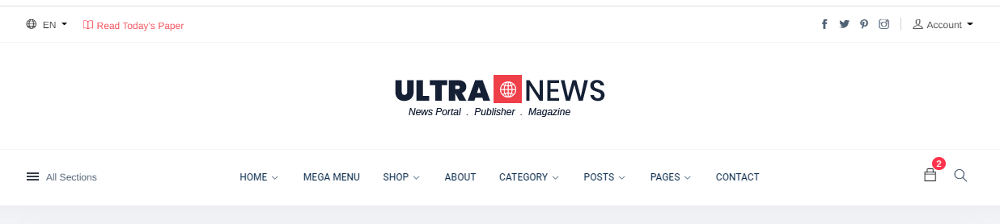
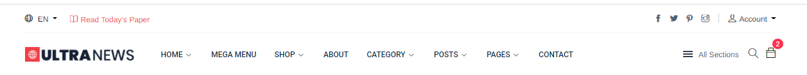
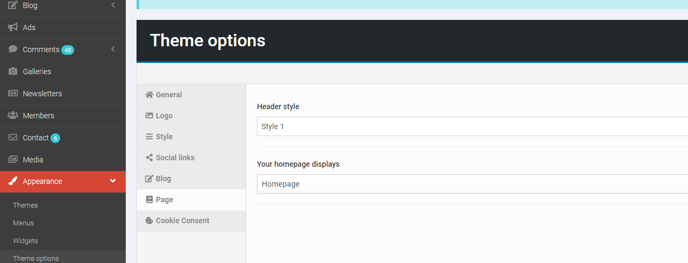
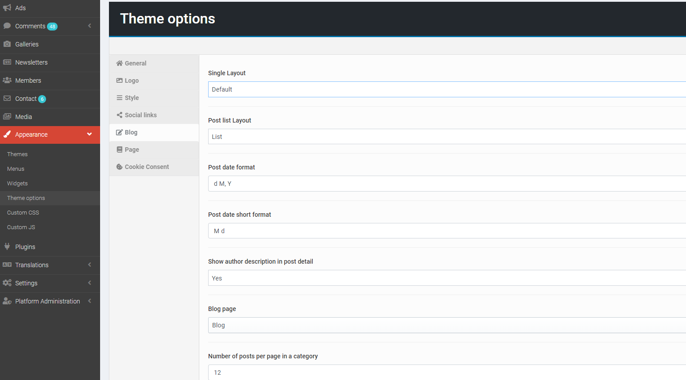

# General

> Go to __Admin -> Appearance -> Theme options__ (tab __General__).

In theme option, you can easily alter the following under:
+ Site title
+ SEO Title
+ SEO Description
+ Site Logo
+ Style: header style, page layout, font size, font family
+ Socials
+ Copyright
+ Designed by
+ Enable Preloader
+ Site description
+ Address
+ Phone
+ Enable Facebook chat
+ Facebook page ID
+ Enable Facebook comments
+ Cookie page
+ ...

## Logo & favicon

> __Admin -> Appearance -> Theme options__ (tab __Logo__).

## Font & color.

> __Admin -> Appearance -> Theme options__ (tab __Style__).

## Social link.

> __Admin -> Appearance -> Theme options__ (tab __Social__).

 

##  Header style

We have support for 3 header styles. It's up to you to configure the header accordingly

- **Style 1:** 

- **Style 2:** 

- **Style 3:** 

To change header style, you can access to
>  __Admin -> Appearance -> Theme options__ (tab __Page__).

 

##  Post detail style

We have support for 3 styles for post detail depending on your website purpose

- **Style 1:** 

- **Style 2:** 

- **Style 3:** 

To change post detail style, you can access to
>  __Admin -> Appearance -> Theme options__ (tab __Blog__).

You also can change the number of posts per page, category list layout, date format, show author in each post

## Cookie consent.

> __Admin -> Appearance -> Theme options__ (tab __Cookie Consent__).

 

