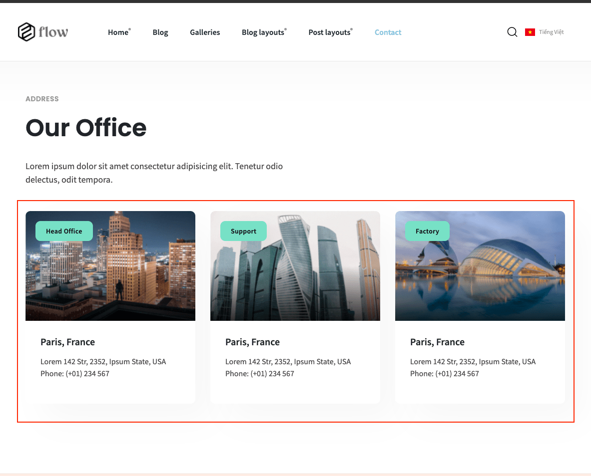

# General

> Go to __Admin -> Appearance -> Theme options__ (tab __General__).

In theme option, you can easily edit: 
+ Site title
+ SEO Title
+ SEO Description
+ Site Logo
+ Style: header style, page layout, font size, font family
+ Socials
+ Copyright
+ Designed by
+ Enable Preloader
+ Site description
+ Address
+ Phone
+ Enable Facebook chat
+ Facebook page ID
+ Enable Facebook comments
+ Cookie page
+ ...

## Logo & favicon

> It's in __Admin -> Appearance -> Theme__ options (tab __Logo__).

## Font & color.

> It's in __Admin -> Appearance -> Theme__ options (tab __Style__).

## Social link.

> It's in __Admin -> Appearance -> Theme__ options (tab __Social__).

 

##  Contact info boxes.

> It's in __Admin -> Appearance -> Theme__ options (tab __ Contact info boxes__).

 

 

## Cookie consent.

> It's in __Admin -> Appearance -> Theme__ options (tab __Cookie Consent__).

 

