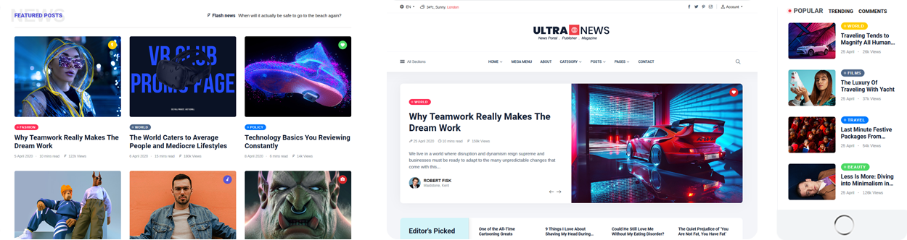
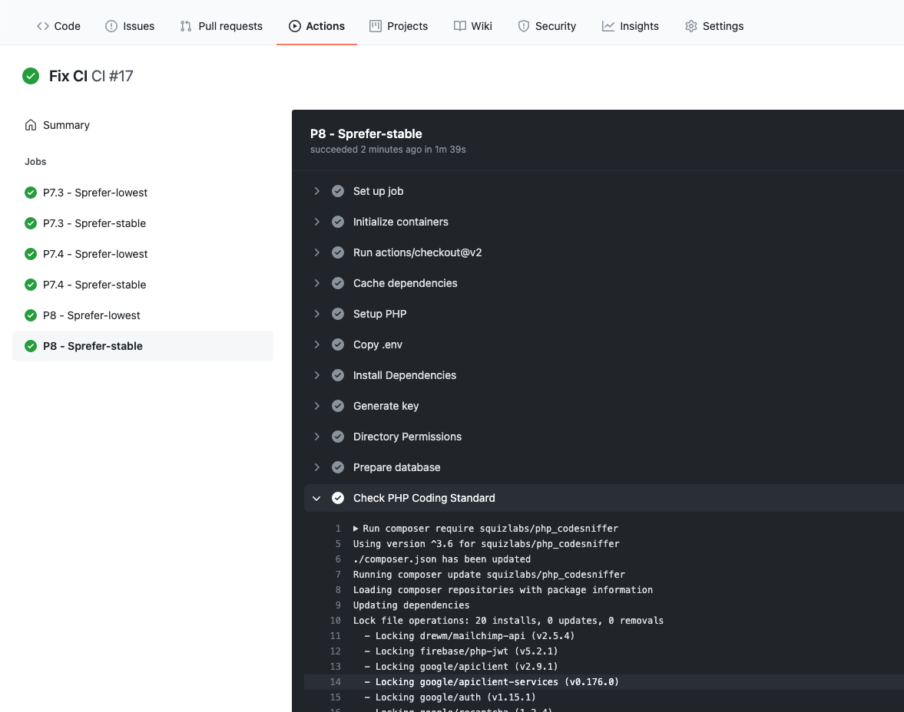

# Ultra News - Create flexible news,magazine,blog and travel

- [Introduction](#introduction)
- [Demo](#demo)
- [Why choose us](#why_choose_us)
- [TheSky9 Team](#thesky9_team)

## Introduction

UltraNews is a Creative Multilingual News script using Laravel 8.x.

It is a powerful, multipurpose and modern Bootstrap 4 magazine template with pixel perfect design, outstanding features, fully responsive and mobile-friendly. It is a very flexible and well suited for recipe, fashion, travel, technology, personal or any other awesome magazine and blog websites.

By: [TheSky9 Technologies](https://thesky9.com) Email: [thesky9.com@gmail.com](mailto:thesky9.com@gmail.com)

Thank you for purchasing this product. If you have any questions that are beyond the scope of this help file, 
please feel free to email via my user page contact form [here](https://codecanyon.net.net/user/thesky9) for quickly support. Thank you so much!

		

## Demo

Homepage: [https://ultranews.thesky9.com](https://ultranews.thesky9.com)

Admin Area: [https://ultranews.thesky9.com/admin](https://ultranews.thesky9.com/admin)

Username: `admin`

Password: `12345678`

## TheSky9 Team

Visit us at [https://thesky9.com](thesky9.com)

## Why choose us

Coding Standard: All code follow coding standards PSR-2 and best practices. Validated by [PHP_CodeSniffer](https://github.com/squizlabs/PHP_CodeSniffer)

Fully Responsive: Compatible with all screen resolutions

Powerful Permission System: Manage user, team, role by permissions. Easy to manage user by permissions.

Page, blog, menu, contact modules are provided with the use of components to avoid boilerplate code.

A vast number of jQuery components are provided, which helps you save time.

Admin template comes with color schemes to match your taste.
		

## TheSky9 Team

Visit us at [https://thesky9.com](thesky9.com)