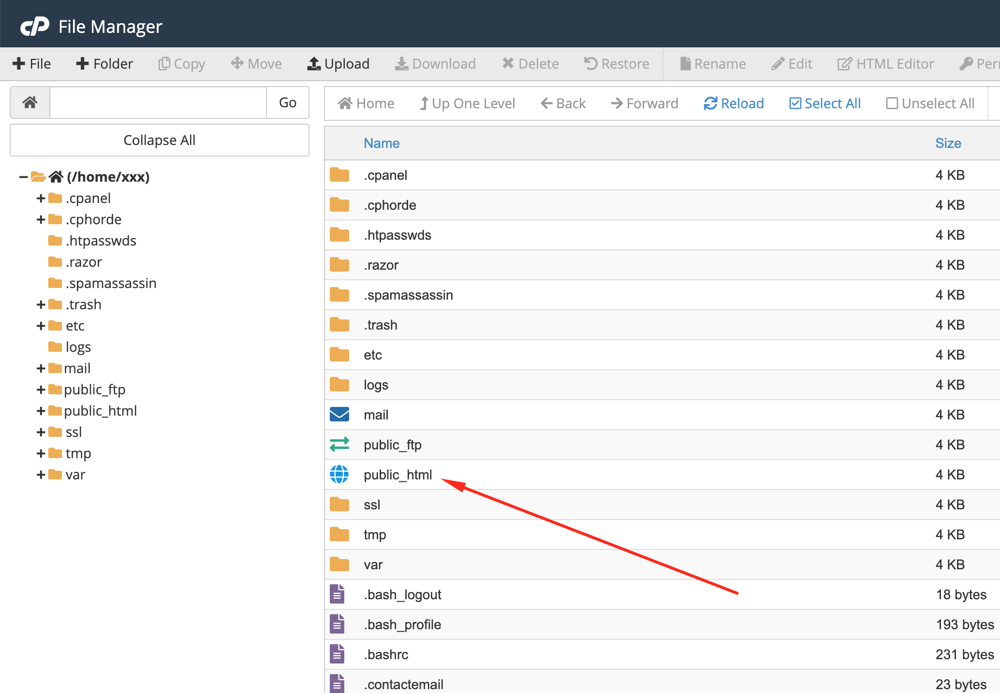
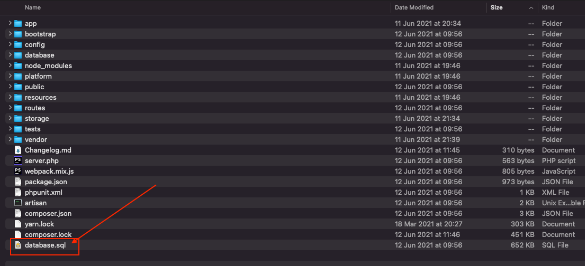
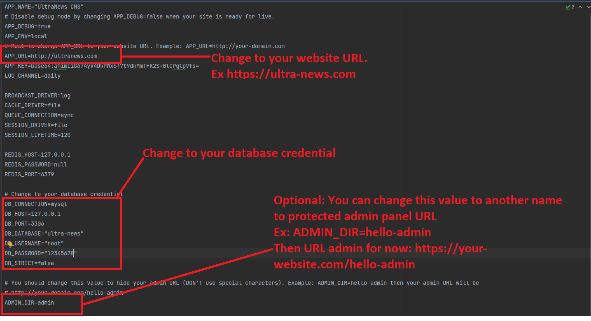

# Install on hosting

1. Upload all files into the root folder of your hosting (normally, it is `public_html`) .

2. Create a database from database management and import from file database.sql (this file in source code).

3. Open file `.env` and update your credentials.

+ **You need to set up database connection before doing the next steps.**
~~~
DB_HOST=127.0.0.1
DB_PORT=3306
DB_DATABASE="your-database"
DB_USERNAME="username"
DB_PASSWORD="password"
~~~
+ Make sure `APP_URL` in `.env` is correct your domain. It should be `APP_URL=http://your-domain.com`
  
  
4. **Well done!** Go to admin panel to manage your site `http://your-domain.com/admin` 
- The default admin account is `admin` - `12345678`

  

**Notes**: *We are providing free installation service on Cpanel or Direct Admin for 1 time. 
So you can contact us for installation if you can't do it successfully.
Please send an email to **thesky9.com@gmail.com***
