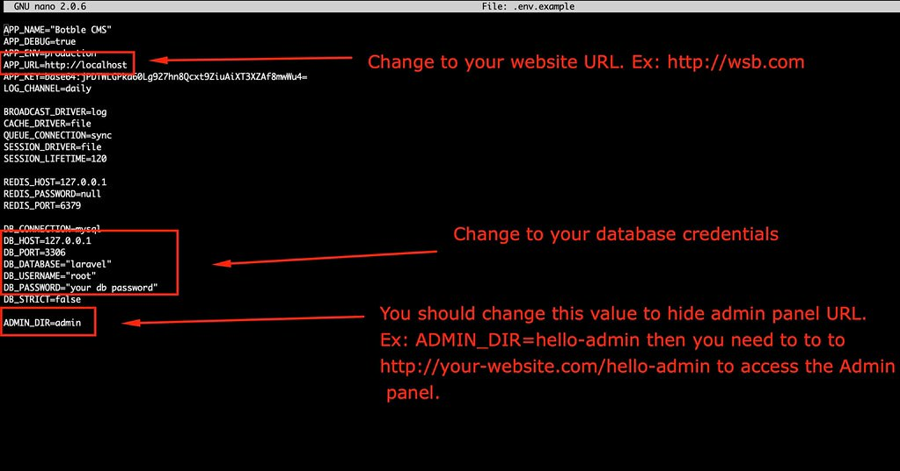

# Install locally or in VPS

> If you're a Laravel developer and you want to customize our source code in `platform/core` and `platform/packages`, you need to delete folder `/vendor` then run command `composer install` to reinstall vendor packages.

  

- Create `.env` file from `.env-example` and update your configuration.

- Using sample data: 
    - Import database from `database.sql`.
    
- Don't use sample data:
    - Run `php artisan migrate` to create database structure.

    - Run `php artisan cms:user:create` to create admin user.
    
    - Run `php artisan cms:theme:activate flow`

- If you're pulled source code from GIT server:
    - Run `php artisan vendor:publish --tag=cms-public --force`
    - Run `php artisan cms:theme:assets:publish`

- Run web locally:
    - Change `APP_URL` in `.env` to `APP_URL=http://localhost:8000`
    - Run `php artisan serve`. Open `http://localhost:8000`, you should see the homepage.
    - Go to `/admin` to access to admin panel.
    - If you're using sample data, the default admin account is `admin` - `12345678`.
    - If you don't use sample data, you need to go to Admin -> Plugins then activate all plugins.