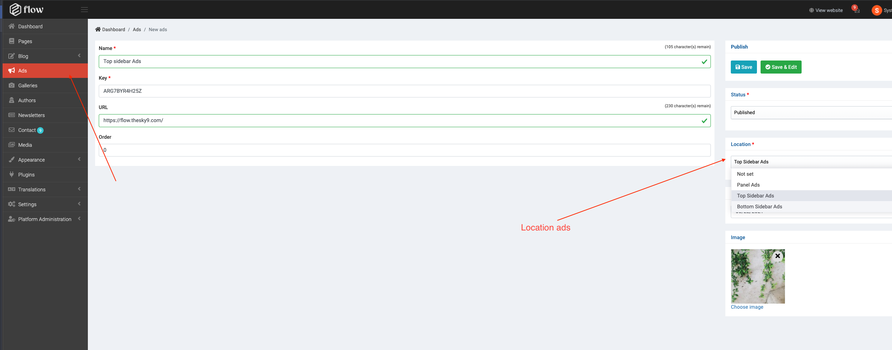
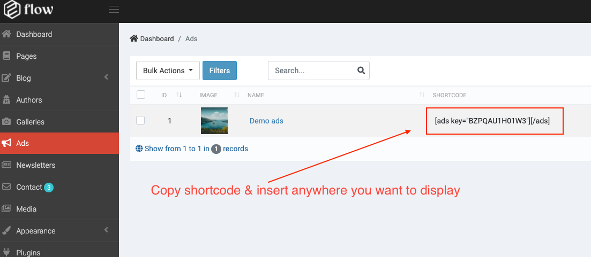
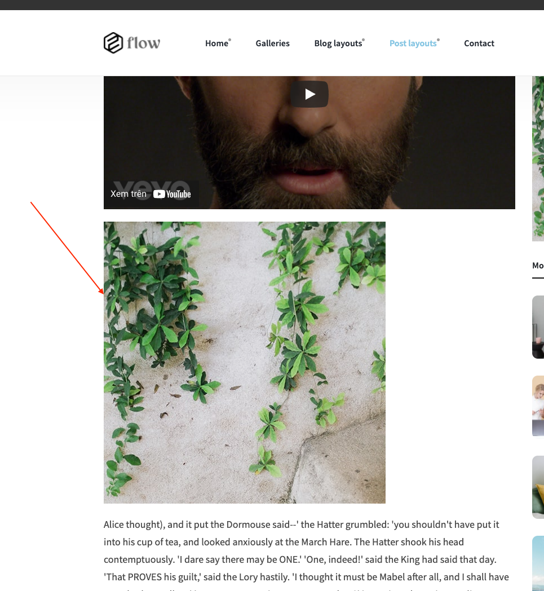
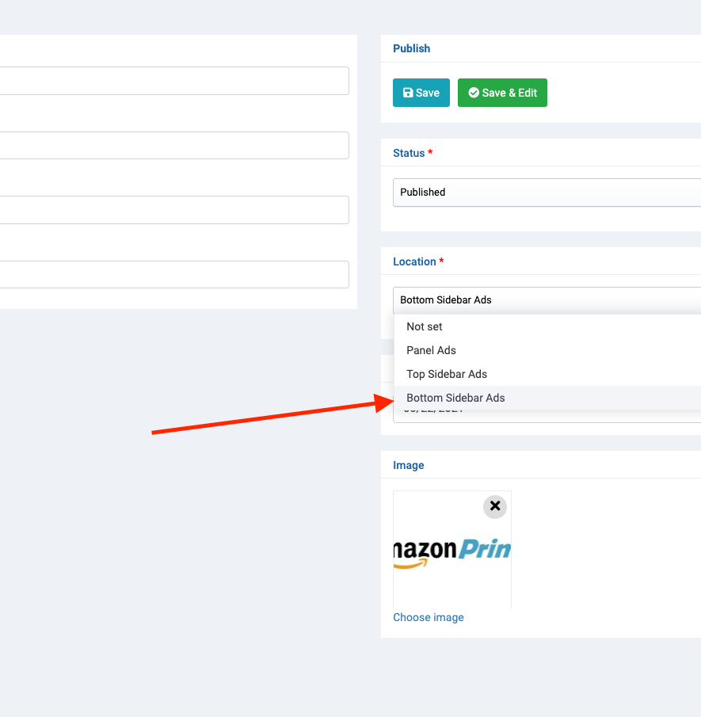
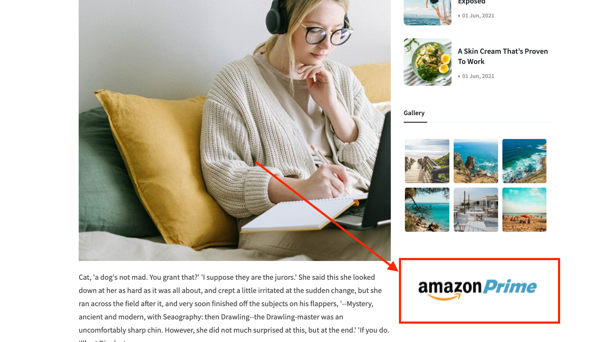

# Ads

## Insert in article or page

> Create ads

> Copy shortcode

> Insert anywhere you want to display

## It show in the register locations we have already registered.

> Create ads and chosen location
- Ex: Show bottom sidebar

