#  Analytics

Integrate with Google Analytics

## Getting credentials

- Go to https://console.developers.google.com/apis/dashboard and create a new project.

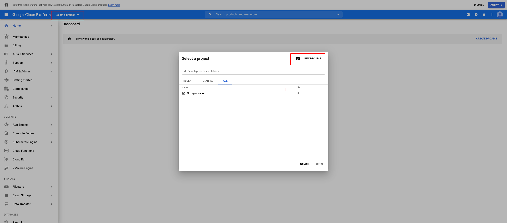

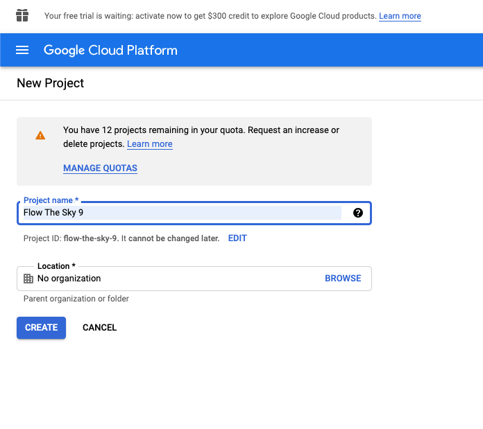

- Select your project and click on __"ENABLE APIS AND SERVICES"__:

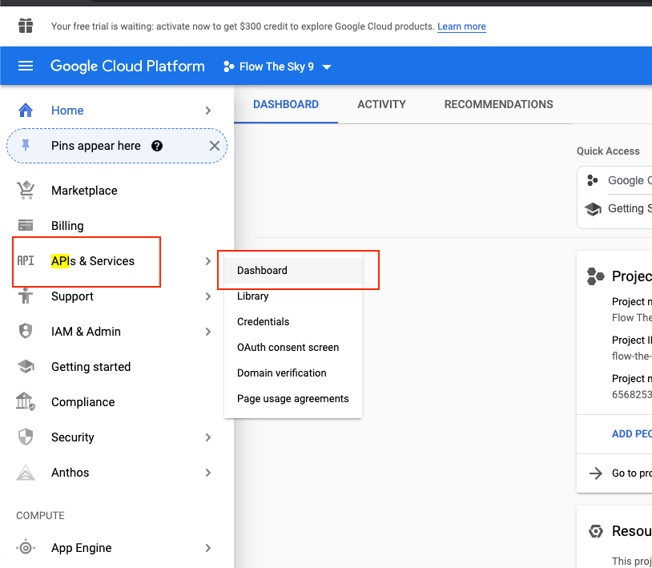

- Enable API:

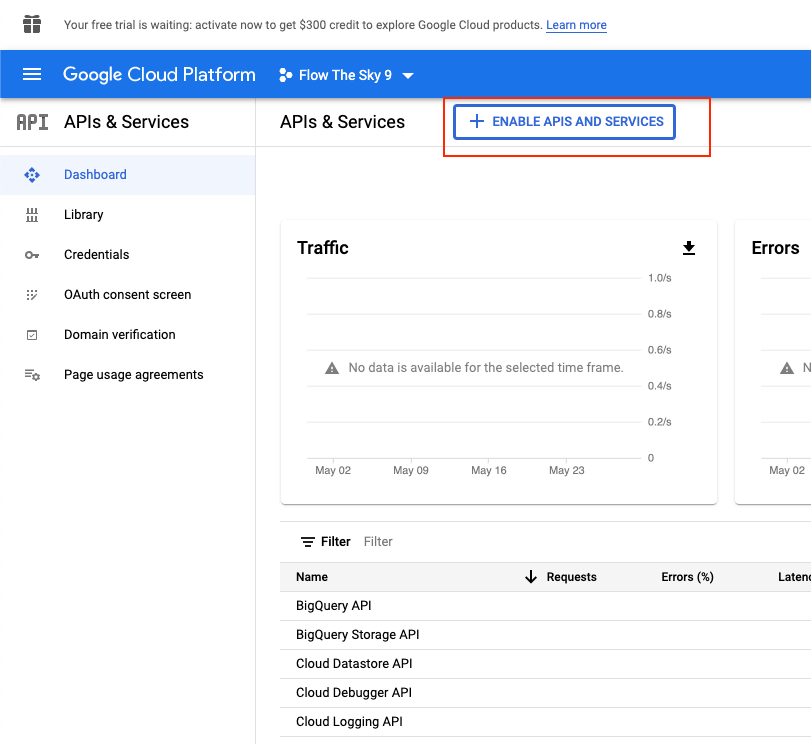

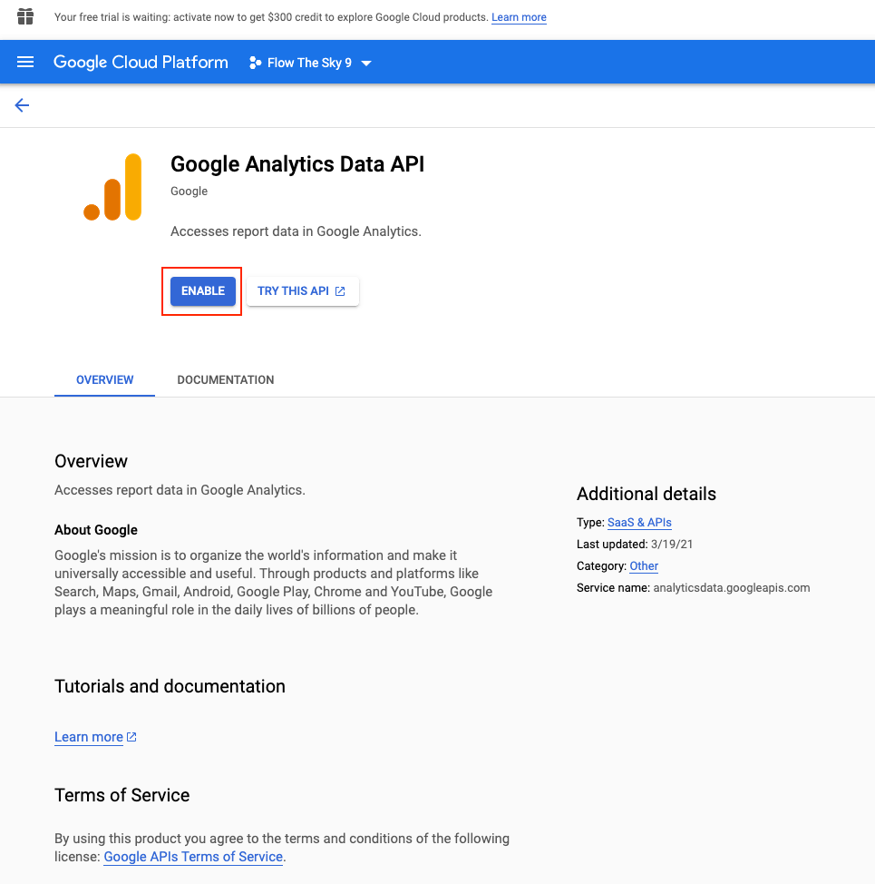

- Generate service account key

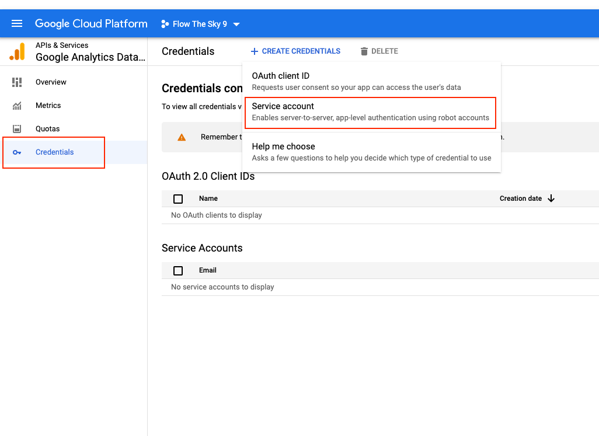

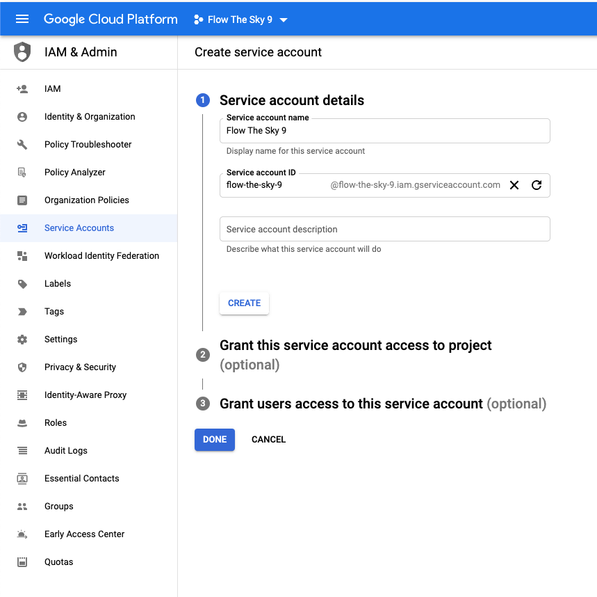

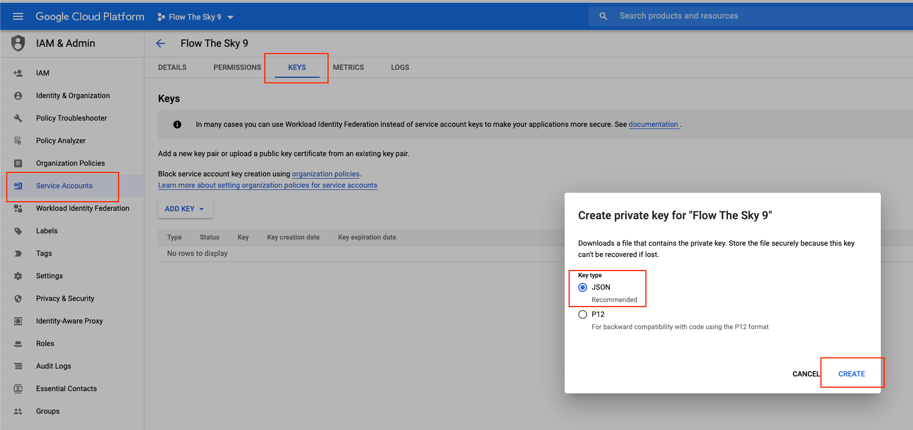

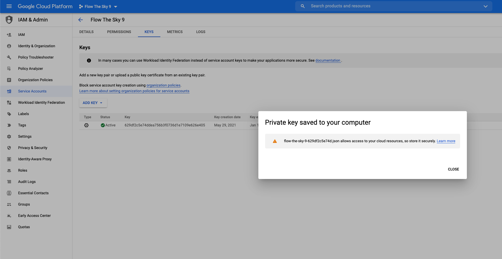

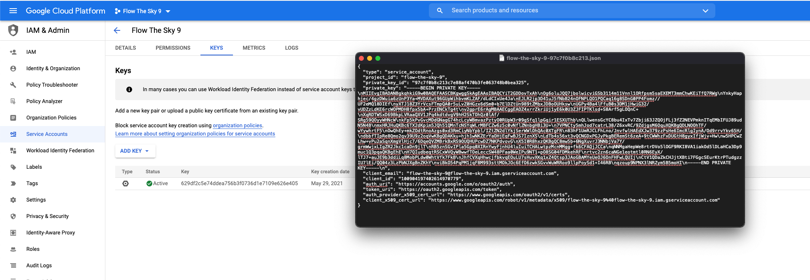

- Open JSON file and copy its content, then go to __Admin -> Settings -> General (/admin/settings/general)__ and update field __"Service Account Credentials"__ in Analytics plugin settings by the content from JSON file:

It will look like this:

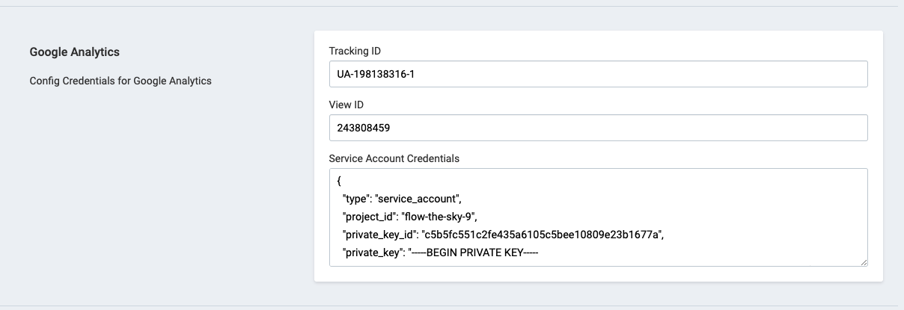

## Setting Google Analytics

- Go to Google Analytics account: https://analytics.google.com/analytics/web/. Click on "Admin" => "View Settings" and copy "View ID" number, then go to /admin/settings/general and tab "Google Analytics" and paste to field View ID.

Note: Change in Google Analytics 4 property.

When creating a new property, you need to check the "Create a Universal Analytics Property" checkbox.

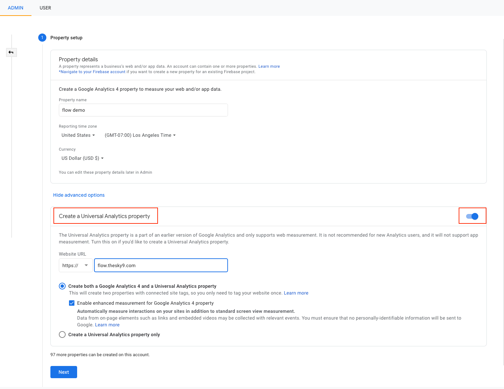

Then you will have view settings tab and View ID.

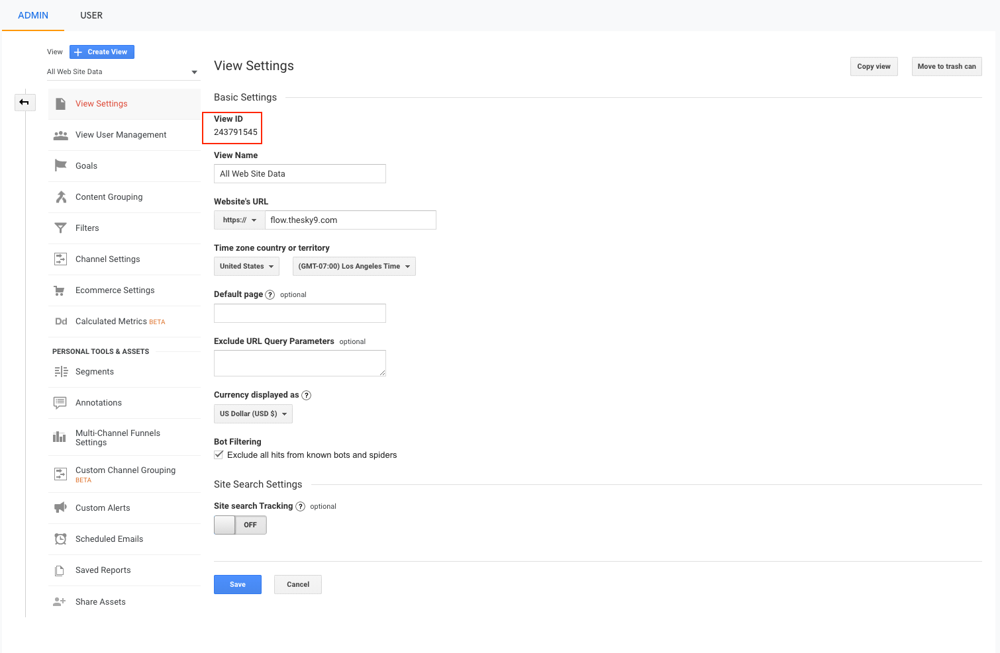

- Open JSON credentials file and copy client email. Then click on "User management" and add that email to list account. Just need view only permission.

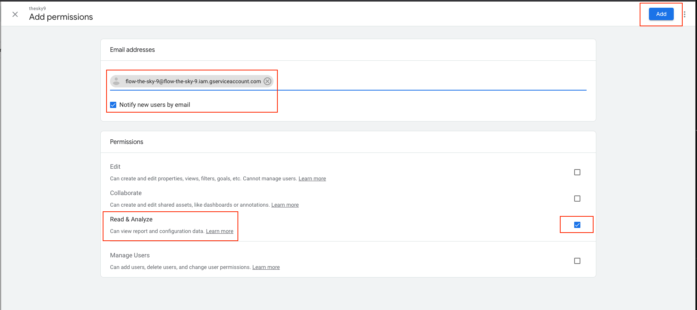

Give your comment here if you got any problem.

Good luck!