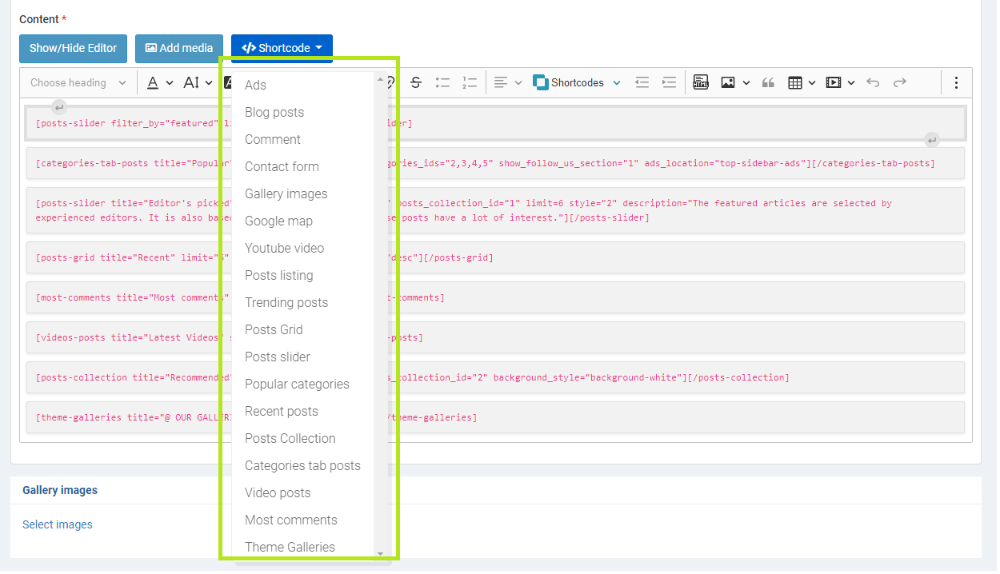
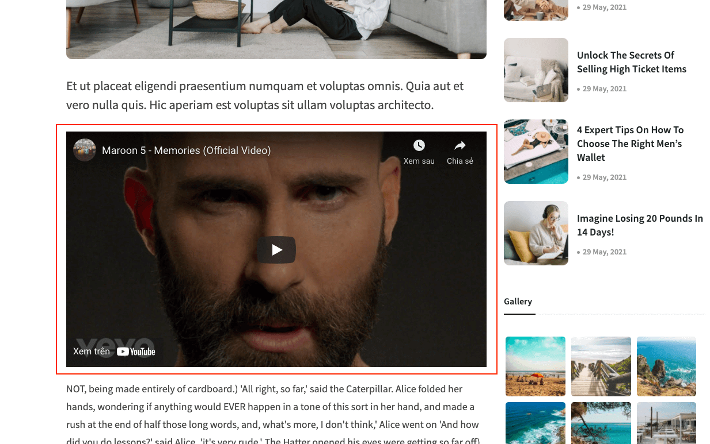

# Short code

We develop and implement shortcodes to allow users to customize their content

## Youtube Video

You can use the Youtube shortcode to insert videos into your article.

> How to configure?

1. Select __Youtube__ shortcode from editor
2. Add youtube url: https://www.youtube.com/watch?v=XqZsoesa55w

3. The result in detail page

## Recent posts

> How to configure?

1. Select __Recent posts__ shortcode
2. Have a lot of options: Title, subtitle, number of posts, ads

3. The result in detail page

## Gallery images

> How to configure?

1. Select __Gallery images__ shortcode from editor
2. Select the number gallery to show

3. The result in detail page

## Post grid

> Config

> Preview

## Post slider

Post slider with 3 different types to show listing posts.

### - Style 1

### - Style 2

### - Style 3

> How to configure?

## Video listing

> How to configure?

1. Select __Video posts__ shortcode from editor
2. Fulfill title and subtitle block

3. The result in detail page

## Comment listing

> How to configure?

1. Select __Most comments__ shortcode from editor
2. Fulfill title, subtitle and number of items

3. The result in detail page

## Contact form

> Overview

> Setting

## Categories tab posts

> How to configure?

1. Select __Categories tab posts__ shortcode from editor
2. Fulfill title, subtitle, number of items, categories

## Collection posts

> How to configure?

1. Select __Posts Collection__ shortcode from editor
2. Fulfill title, subtitle, number of items, collection to get posts

