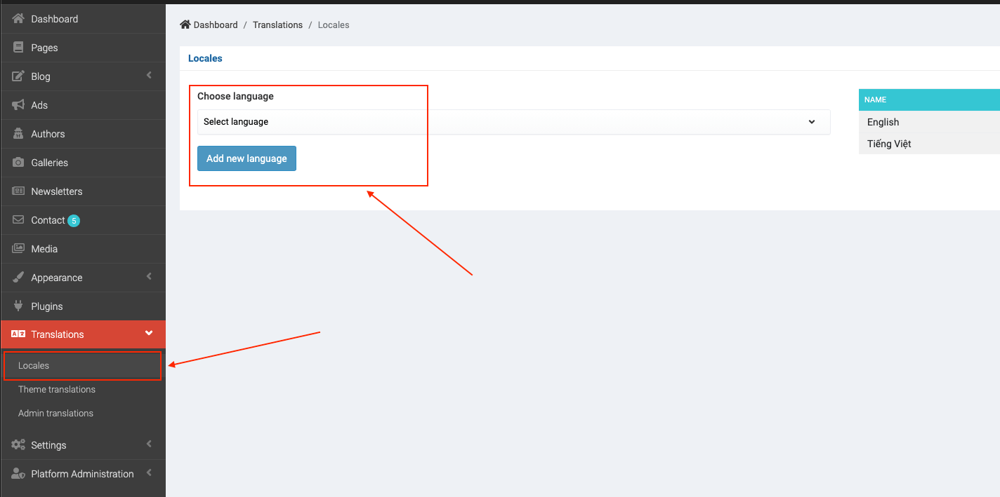
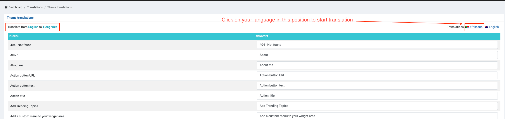
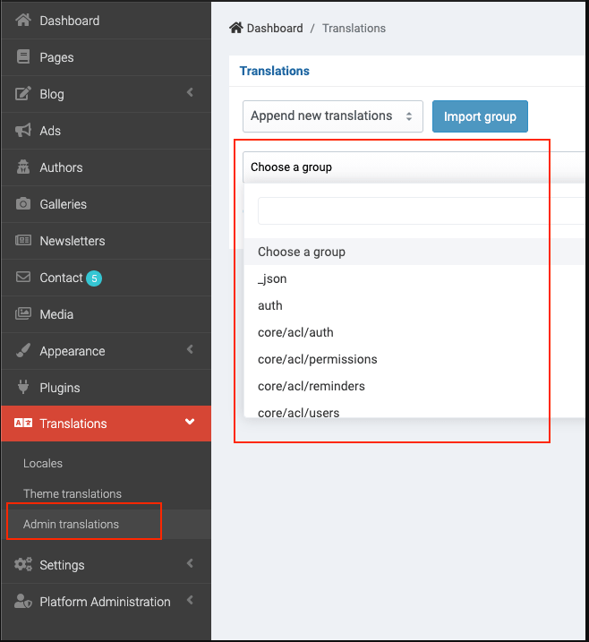
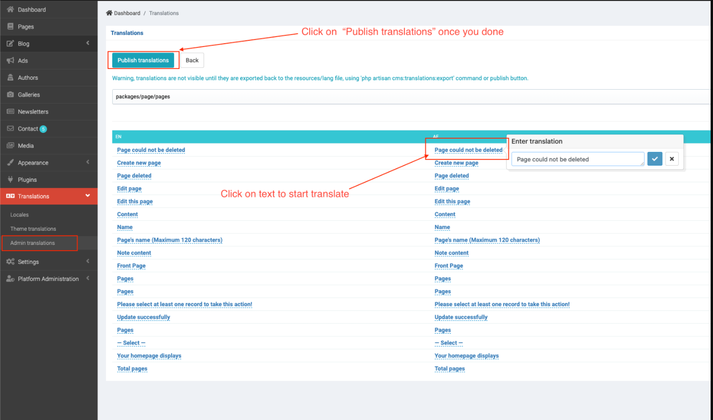

# Translate

- [Translate Theme](#translate-theme)
- [Translate Admin panel](#translate-admin-panel)

## Translate Theme

> It's theme translation, your site just can be displayed on 1 language, we don't support multiple languages for now.

You can add your language in __Admin -> Translations -> Locales__.

After adding your language, you can go to __Admin -> Translations -> Theme__ translations to translate theme to your language:

When you done, click on the Save button on the bottom of page to publish translation.

## Translate Admin panel

If you want to translate admin panel too, you can translate it in __Admin -> Translations -> Admin translations__.

